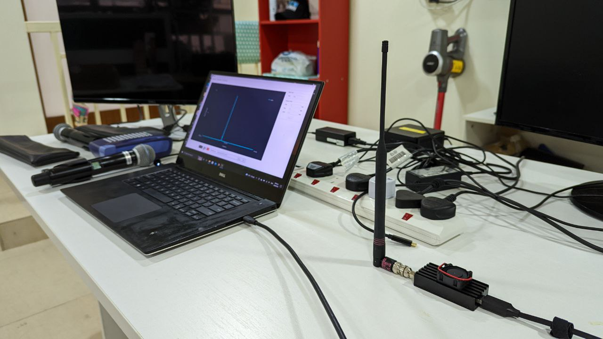
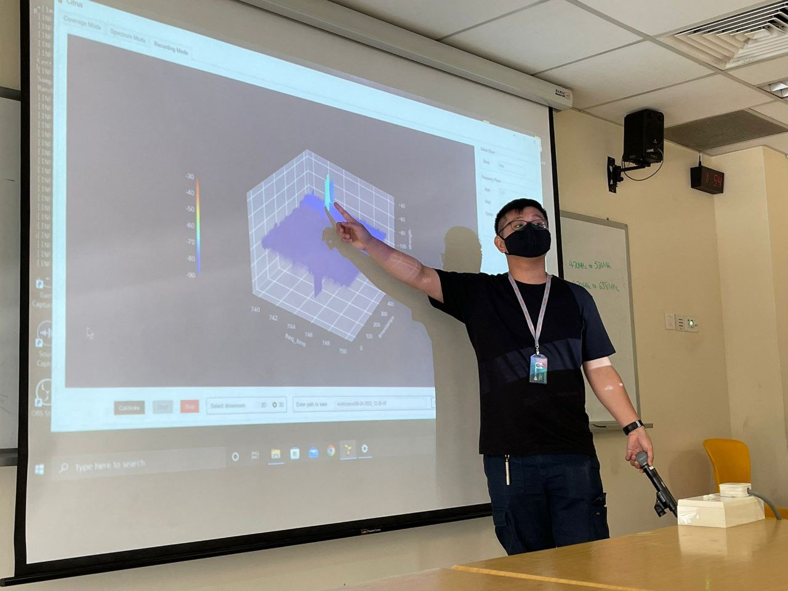
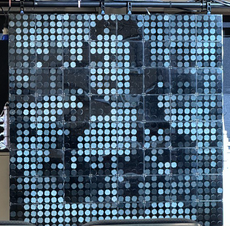
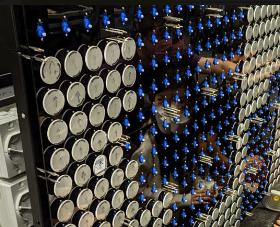
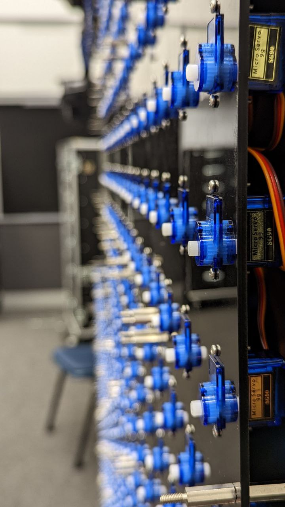
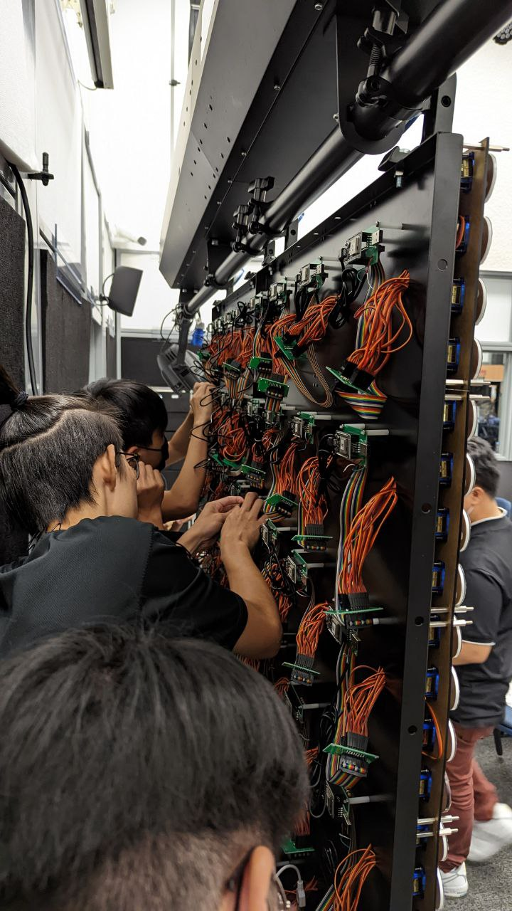

## Upcoming Projects

### Lux-gram
Communication using physical properties of light and total internal reflection.  
Infused with sensors, computer vision, interactive media and immersive AV.
 
<!-- Insert Lux-gram pic -->
 

## Past Works

### First works - Citrus
Visualization tool for analysisng Wireless and RF signals with Software Defined Radio.  
Open-Surce Software
 
  
 

### Sopiart
Painting with sound.  
Foundation for more student creativity.
 
<!-- Insert Sopiart pics -->
 

### Pixel Tint
Communication using physical properties of light and polarization.  
Infused with Artificial Intelligence and Computer Vision.
 
   
 

